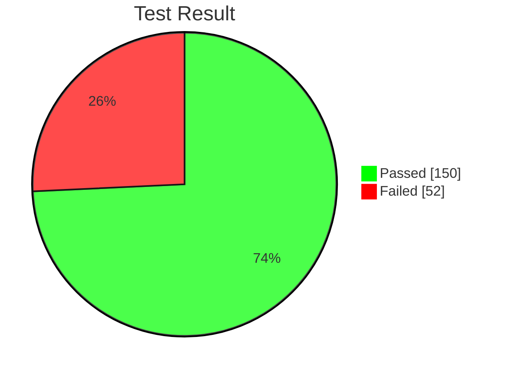
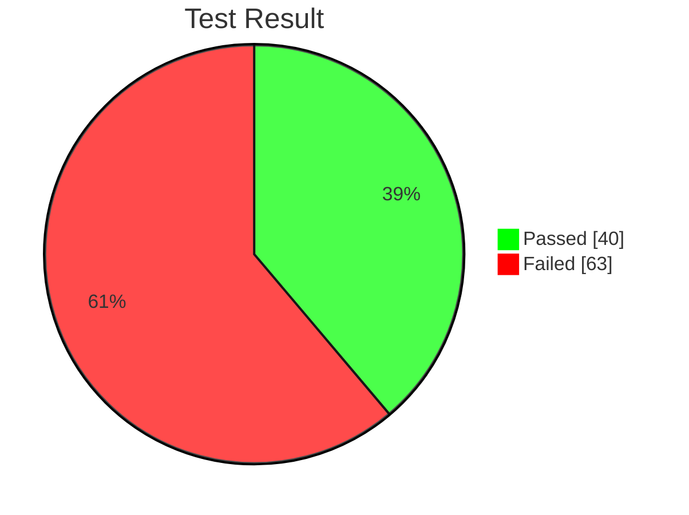
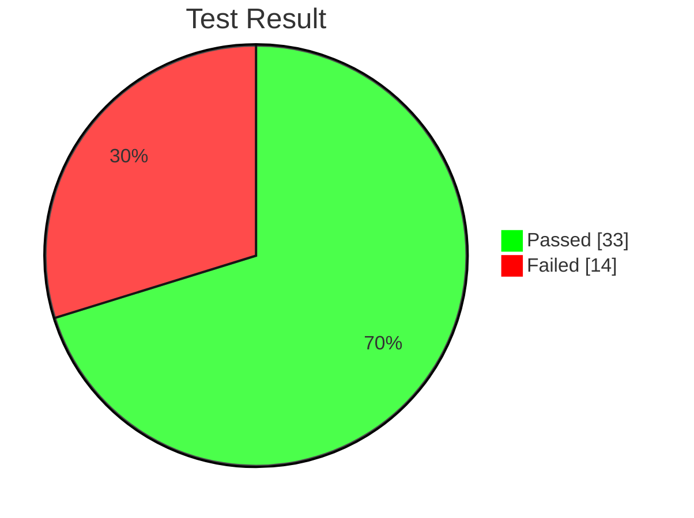
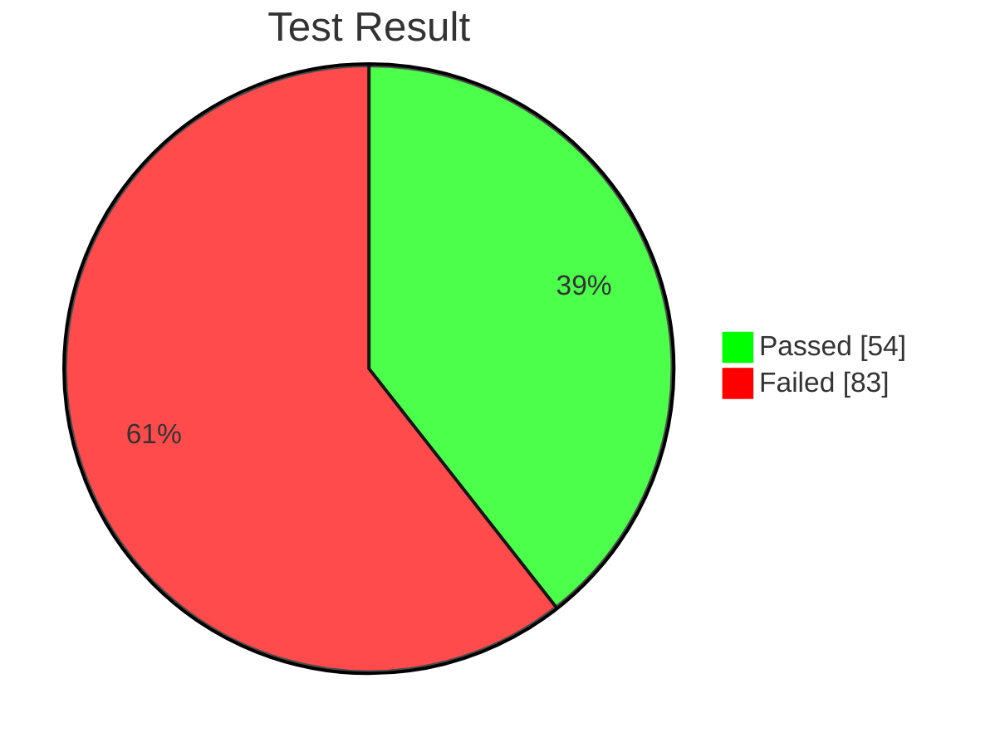
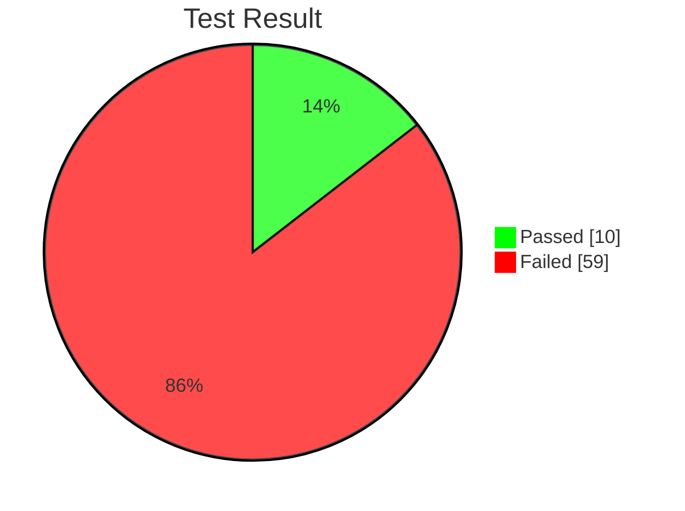

# 우아한테크코스 프리코스 채점 프로그램

간단하게 만든 우아한테크코스 프리코스 채점 프로그램입니다.

## 동작 과정
1. 환경변수로 지정된 레포지토리(ex. `woowacourse-precourse/javascript-menu`)의 Pull Request 목록을 받아옵니다.
2. 모든 Pull Request를 clone합니다.
3. 제한된 dependency만 설치되어 있는 Docker Container에서 채점(테스트)을 진행합니다.
4. 채점 결과들을 tsv로 정리하고 README.md 파일에 요약해줍니다.

## 실행 방법

이 프로젝트를 실행하려면 python 3.10 또는 그 이상과 docker, make가 필요합니다.

### .env 환경변수 설정

.env 파일을 생성한 다음 아래와 같은 형식으로 내용을 입력해주세요.
```
GITHUB_TOKEN=YOUR_GITHUB_TOKEN
GITHUB_REPOSITORY=woowacourse-precourse/javascript-menu
PULL_STATE=open
JUDGE_VM_DOCKER_IMAGE=woowacourse-precourse-judge/vm-node:14-jest
JUDGE_LIMIT_CONCURRENCY=5
```

* `GITHUB_TOKEN` 은 GitHub 개발자 설정에서 발급받을 수 있습니다.
* `GITHUB_REPOSITORY` 는 채점할 레포지토리입니다.
* `PULL_STATE` 는 open/close되어있는 Pull Request로 한정합니다.
* `JUDGE_VM_DOCKER_IMAGE` 는 채점에 사용할 Docker 이미지입니다. **채점용 Docker 이미지 목록**을 참고해주세요.
* `JUDGE_LIMIT_CONCURRENCY` 는 동시에 채점할 갯수입니다.
  * 컴퓨터 사양에 따라 적당히 조절해주세요.
  * i5-10400 기준으로, javascript는 10, java는 5가 적당합니다.

### 채점용 Docker 이미지 빌드

```sh
$ make vm
```

### 채점용 Docker 이미지 목록
|이미지 이름|설명|
|-|-|
|woowacourse-precourse-judge/vm-node:14-jest|node 14에서 jest로 테스트 시 사용합니다.|
|woowacourse-precourse-judge/vm-node:14-cypress|node 14에서 cypress로 테스트 시 사용합니다.|
|woowacourse-precourse-judge/vm-java:11|Java 11에서 gradle로 테스트 시 사용합니다.|
|woowacourse-precourse-judge/vm-kotlin:1.6.20|Kotlin 1.6.20에서 gradle로 테스트 시 사용합니다.|

위 이미지들은 모두 woowacourse-precourse에서 제공하는 mission-utils 의존성이 포함되어 있습니다.

### 파이썬 스크립트들을 실행하기 위한 dependency 설치

```sh
$ python -m venv .venv
$ . .venv/bin/activate
$ pip install -r requirements.txt
```
> 이 프로젝트에서는 GitPython, PyGithub, tqdm과 같은 라이브러리를 사용합니다.

### Pull Request 클론

```sh
$ python scripts/clone_pulls.py
```
모든 Pull Request를 clone합니다. 시간이 다소 소요될 수 있습니다.

### (optional) overrides 추가

테스트를 지정하거나, 빌드 설정을 수정하고 싶을 때 overrides를 사용하세요.

overrides 폴더를 만들고 파일을 추가하면 파일을 덮어씌운 후 채점을 진행하게 됩니다.

`judge/{owner}/{repo}/overrides` 폴더를 생성한 후 덮어씌우고 싶은 파일을 추가하면 됩니다.

```
judge/
  woowacourse-precourse/
    javascript-menu/
      overrides/
        __tests__/
          ApplicationTest.js
        package.json
```
위는 `woowacourse-precourse/javascript-menu` 에 대해 overrides를 추가한 예시입니다.
위의 예시에서는 overrides 폴더의 __tests__/ApplicationTest.js로 채점을 진행합니다.

### 채점

```sh
$ python scripts/judge.py
```
채점을 진행합니다. 시간이 다소 소요될 수 있습니다.

> 채점에서 제외하고 싶은 Pull Request가 있다면 스크립트를 실행하기 전에 pulls.tsv 파일을 수정해주세요.

## 채점 결과

채점 결과물은 모두 judge/{owner}/{repository_name} 에 저장됩니다.

* judge-outputs: 채점 진행 중 출력을 저장합니다.
* pulls: clone한 Pull Request가 여기에 저장됩니다.
* judge-results.tsv: 각 채점 당 테스트 결과가 tsv 형식으로 저장됩니다.
* pulls.tsv: clone한 Pull Request 목록이 tsv 형식으로 저장됩니다.
* README.md: 채점 결과를 요약하여 표시합니다.

# woowacourse-precourse/java-menu: Pull Request Test Report

> 테스트 환경에 따라 차이가 발생할 수 있습니다.

Total Pulls: **202**

Total Passed: **150**

Total Failed: **52**



# woowacourse-precourse/javascript-menu: Pull Request Test Report

> 테스트 환경에 따라 차이가 발생할 수 있습니다.

Total Pulls: **103**

Total Passed: **40**

Total Failed: **63**



## woowacourse-precourse/kotlin-menu: Pull Request Test Report

> 테스트 환경에 따라 차이가 발생할 수 있습니다.

Total Pulls: **47**

Total Passed: **33**

Total Failed: **14**



## woowacourse/java-pairmatching-precourse: Pull Request Test Report

> 테스트 환경에 따라 차이가 발생할 수 있습니다.

Total Pulls: **137**

Total Passed: **54**

Total Failed: **83**



## woowacourse/javascript-teammatching-precourse: Pull Request Test Report

> 테스트 환경에 따라 차이가 발생할 수 있습니다.

Total Pulls: **69**

Total Passed: **10**

Total Failed: **59**


