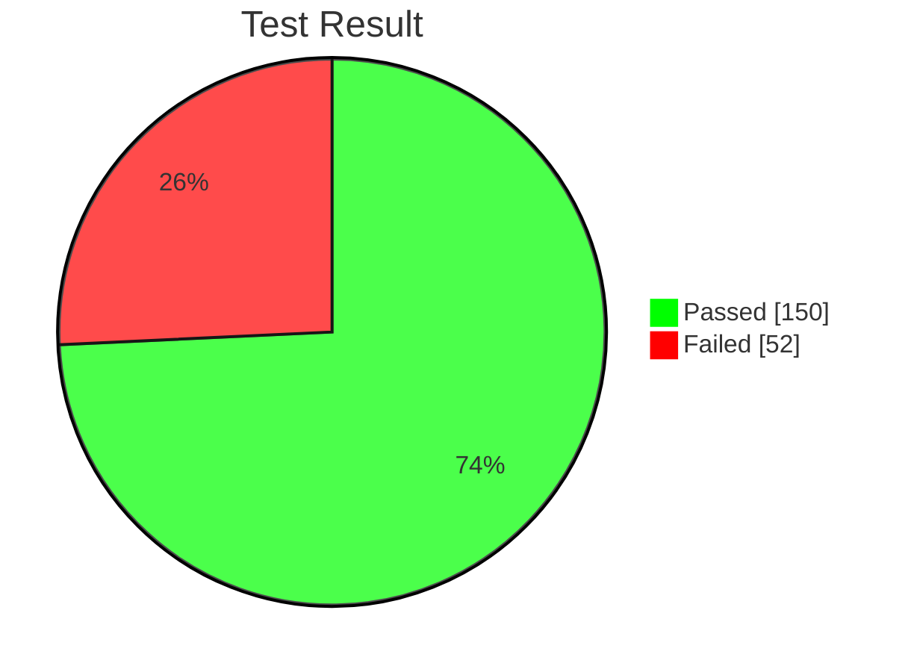

# woowacourse-precourse/java-menu: Pull Request Test Report

Total Pulls: **202**

Total Passed: **150**

Total Failed: **52**

```mermaid
%%{init: {'theme': 'base', 'themeVariables': { 'pie1': '#00FF00', 'pie2': '#FF0000' }}}%%
pie showData
    title Test Result
    "Passed": 150
    "Failed": 52
```
