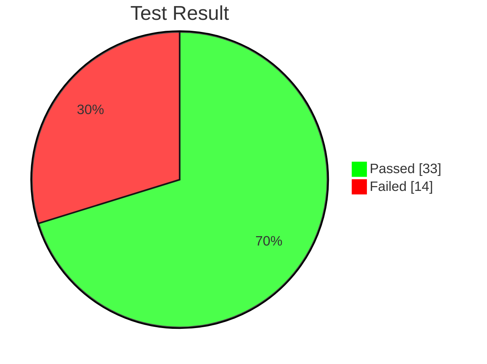

# woowacourse-precourse/kotlin-menu: Pull Request Test Report

Total Pulls: **47**

Total Passed: **33**

Total Failed: **14**

```mermaid
%%{init: {'theme': 'base', 'themeVariables': { 'pie1': '#00FF00', 'pie2': '#FF0000' }}}%%
pie showData
    title Test Result
    "Passed": 33
    "Failed": 14
```
