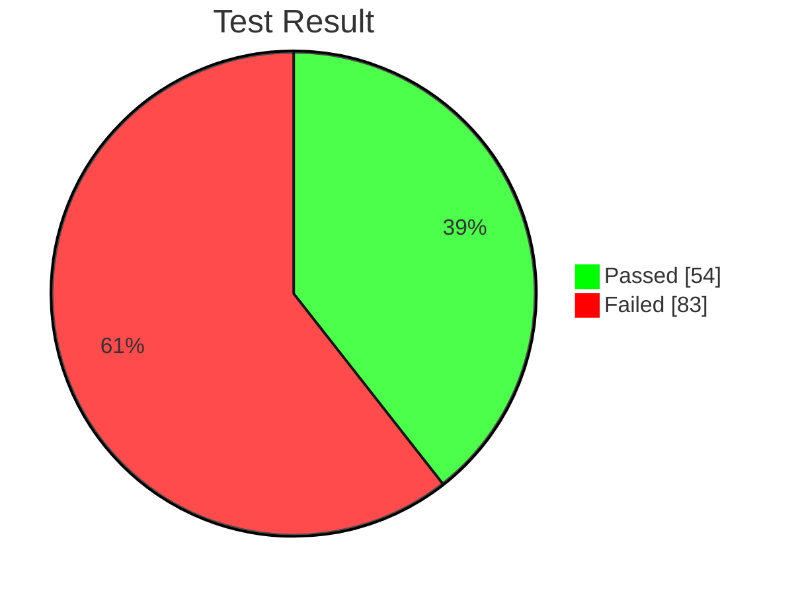

# woowacourse/java-pairmatching-precourse: Pull Request Test Report

Total Pulls: **137**

Total Passed: **54**

Total Failed: **83**

```mermaid
%%{init: {'theme': 'base', 'themeVariables': { 'pie1': '#00FF00', 'pie2': '#FF0000' }}}%%
pie showData
    title Test Result
    "Passed": 54
    "Failed": 83
```
